## AI-Based Early Diagnosis of Malaria in Blood Smear for Resource-Limited Settings in Africa
Author: Ertony Basilwango*, Seydou Nourou SYLLA* 

### Abstract
Malaria is a deadly infectious disease, mainly affecting children and pregnant women in Africa, with hundreds of thousands of deaths each year. Rapid diagnosis is crucial, but traditional methods such as microscopic examination of blood slides require resources and skills technicians, which are often scarce in rural areas. The main challenge for doctors is decision-making, particularly due to the complexity and variability of symptoms. Therefore computer-aided diagnosis systems assist to prioritize highrisk cases and reduce diagnostic errors. To overcome these situations, a computer-aided diagnosis system is developed to automatically identifying trophozoite stages of P. falciparum Malaria as early identification species, white bloood cell(WBC) and negative cells. A CNN was used as the backbone network for training the artificial intelligence algorithm model architecture to classify whether a cell is infected or not. To achieve high accurancy and recall, YoloV11m and DDQ-Detr(Deformable Dynamic Query DETR) were both combined through NMS ensemble learning techniques to detect and classify trophozoite and WBC. These algorithms were integrated into an end-to-end mobile application, specifically designed to meet diagnostic needs in low-resource settings in Africa. The results showed that the proposed model is capable of detecting the trophozoite stage of Malaria with an accuracy of 0.927 and 0.99 to classify whether a cell is infected or uninfected. Our method outperforms existing approaches in terms of speed and validation on data from.

### Problem Statement
Malaria is endemic in 85 countries, with 627,000 deaths and 246 million cases in 2023.
The World Health Organization (WHO) reports that since 2000, 2.2 billion cases and 12.7 million deaths have been averted worldwide [23]. Traditionally, malaria is diagnosed by examining blood samples under a microscope for parasite-infected red blood cells. This method, however, faces several challenges, including a lack of trained parasitologists and poor facilities in malaria-endemic regions [5]. [9] One of the major obstacles to effective malaria diagnosis is human error, as doctors must process large volumes of data, often leading to inconsistencies in diagnosis. The interpretation of test results is a cognitively demanding task requiring utmost precision. Without expert supervision, microscopy and traditional diagnostic methods can result in incorrect diagnoses, leading to inappropriate treatment. This challenge is particularly significant in regions with limited resources and ### non-professional involvement [3]. Therefore, this study focuses on a systematic review of how malaria diagnosis by light microscopy can effectively improve using artificial intelligence techniques, such as Deep Learning (DL) approaches.

### Study Area, Data, and Methods
##### Data
The dataset used in the study consists of microscopic blood smear images, collected from
patients in malaria-endemic in East Africa regions. These images include both infected and healthy blood samples, focusing on the early-stage malaria parasites (trophozoites). The images in the dataset were captured by placing a smartphone over a microscope to capture the Field of View (FOV) of the blood slide through the eyepiece of the microscope. Along with the image, the slide from which the image was captured, the stage micrometer readings of the microscope, and the objective lens settings were recorded, and a maximum of 40 images was captured from each slide. The dataset is sourced from UGANDA, MAKERERE Artificial Intelligence Health Lab. ### There are 2 747 images in the train and 1178 images in the test. The images were annotated by experts, using bounding boxes to label the life stages of each parasite.

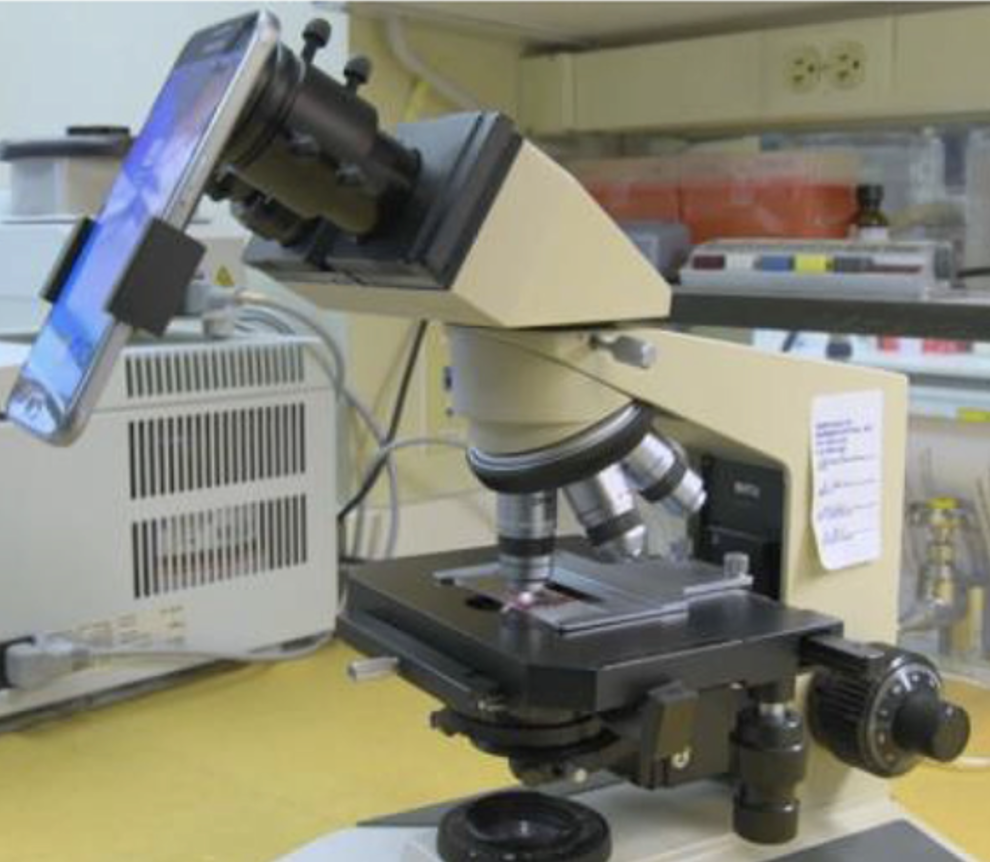

##### Methods

* Preprocessing

As part of this work, an important step was to transform the categorical labels into numerical values. As part of the data preparation for training the YOLO model, a key step was to filter out negative images. We removed duplicates in the Image-D column. The dataset is splitted into two separate subsets to allow for model training and validation. This division is done in a stratified manner using the class column to maintain the proportions of the classes in the two subsets, important when the classes are unbalanced.

* Post-processing

We optimized detection results using Non-Maximum Suppression (NMS) to eliminate redundant bounding boxes. In our ensemble learning approach, NMS effectively combined outputs from two detection models, retaining only the highest-scoring boxes.

##### Methods

* ResNet

In this project, ResNet was used to perform binary classification, determining whether an observation is positive or negative. Data in the negative class exhibit significantly different characteristics, patterns compared to the positive class. Furthermore, The ”NEG” class was extremely underrepresented ( 0.03). By limiting the model to the initial classification between benign and infected images, we reduced the processing load as well.

1. YOLO11

YOLO can be used for a variety of computer
vision tasks, from real-time object detection to
classification, making it a game changer for de-
velopers and researchers. The model employs
a transformer-based backbone, capturing long-
range dependencies to improve small object de-
tection. A dynamic head design adapts to im-
age complexity, optimizing resource allocation
for efficient processing. The C3k2 (Cross Stage
Partial with kernel size 2) block enhances fea-
ture extraction. It primarily enhances multi-
scale feature representation while keeping com-
putational costs lower, while the Spatial Pyra-
mid Pooling - Fast (SPPF) module facilitates
multi-scale feature integration. Additionally,
the C2PSA (Convolutional block with Parallel
Spatial Attention) component improves spatial
attention, contributing to more accurate object
detection and classification.

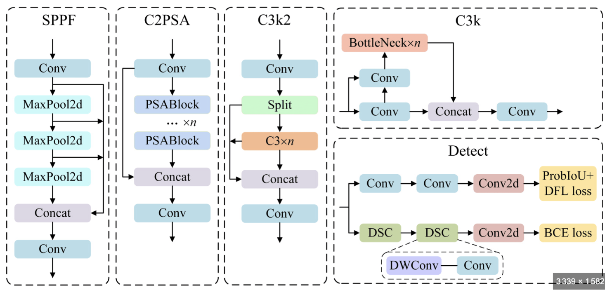
YOLO formulates object detection as a sin-
gle regression task. It divides the image into an S×S grid and assigns each cell the respon-
sibility for detecting objects whose center falls
within it. Each cell predicts Bbounding boxes,
parameterized by (x,y,w,h), along with a con-
fidence score:
Confidence = P(object)×IOU(predicted box, ground truth)

 Class probabilities P(c|object) are also pre-
dicted per cell. The final detection score is:
P(c) = P(object) ×P(c|object)

Non-Maximum Suppression (NMS) is ap-
plied to remove redundant boxes by selecting
the highest-confidence detections. The entire
process is optimized using a loss function that
combines classification, localization, and confi-
dence loss:

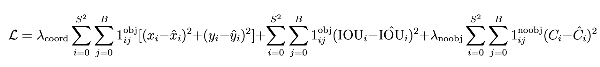

Hyperparameter Settings, the initial learning rate was 1e-3, the weight-decay was 5.7e-05 , and was 0.99. the batch-size was set to 16, dropout: 0.4. The images were preprocessed via the following steps auto-augment: false, copy-paste-mode: flip, degrees: 10.6, fli-plr: 0.5, flipud: 0.5, hsv-h: 0.14, hsv-s: 0.87,
hsv-v: 0.52, mixup: 0.33. Image resolution
2040pp, epoch 60, patience 5, and batch size
32.

* DDQ-DETR

Deformable Dynamic Query Detection Transformer(DDQ DETR) enhances the DETR(Detection Transformer) model by introducing Dense Query Generation to im-prove object recall. It selects Distinct Queries from the dense set to reduce redundancy and optimize detection. The Transformer Encoder-Decoder processes these queries for refined object localization. The Detection
Transformer (DETR) combines transformers
and convolutional neural networks (CNNs) for
end-to-end training. The input image is passed
through a CNN backbone (such as ResNet)
to extract feature maps. These feature maps
represent the spatial structure and information of yhe image.

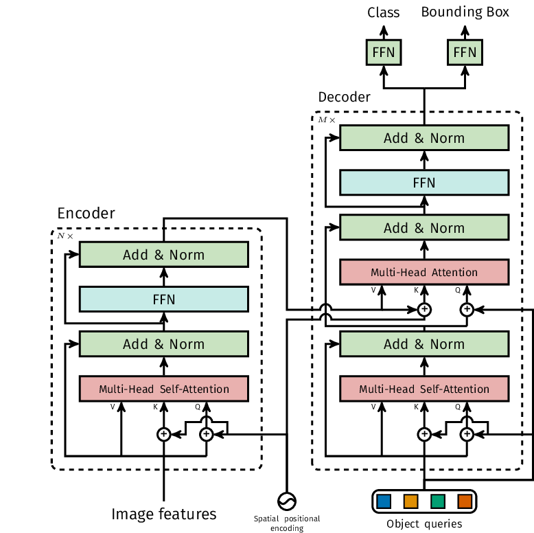

let I ∈RH×W ×C be the input image, where
H is the height, W is the width, and C
is the number of channels. The CNN pro-
cesses this image to generate feature maps F ∈
RH′ ×W ′ ×C′ . Positional encodings are added to
the feature maps to retain the spatial informa-
tion of the image. Let P ∈RH′ ×W ′ ×C′ be the
positional encoding added to the feature map.
Thus, the encoded feature map becomes:

##### Model Evaluation

* Metric

In our study, we used mean accuracy (mAP) as our evaluation metric, specifically mAP@0.5 that combines two essential aspects of object detection. Our ability to localize objects (bounding box accuracy) and our accuracy in classifying what we found (infected or healthy cells). Average Precision (AP): AP is a combined precision and recall metric, calculated as the area under the Precision-Recall curve (AUC) calculated for each object class. The Mean Average Precision (mAP) is the average of the AP values of all detected object classes.

##### Development Pipeline

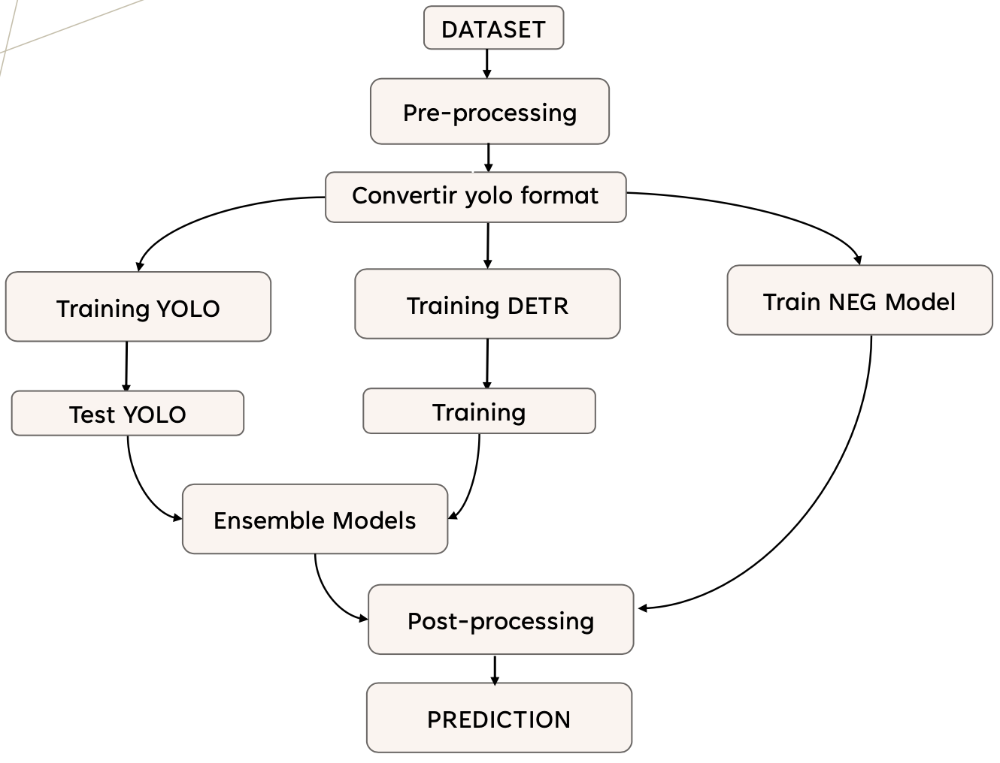
The proposed pipeline preprocesses the dataset and converts it into a YOLO-compatible format. YOLO, DETR, and ResNet models are then trained in parallel to detect uninfected cells. After individual testing, ensemble learning combines their strengths to improve accuracy, followed by post-processing for final predictions.

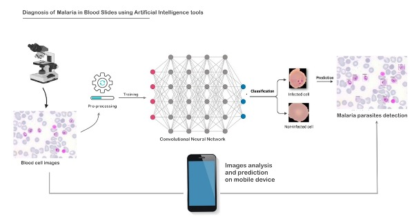

As illustrated in Figure 6, the proposed system offers a user-friendly and intuitive interface. After collecting and preparing a patient’s blood sample using a microscope, the user uploads the blood smear image to the dedicated mobile application. This application directly interacts with the integrated artificial intelligence model. The embedded image processing and analysis module examines the sample to determine if it is infected with malaria parasites. In the case of a positive diagnosis, the model automatically performs a detailed analysis to identify whether the detected parasites are trophozoites or affected white blood cells.

### Experiments and Results

For this task, we experimented with different models, to find the one that generalized best with noisy data.We first tried a segmentation approach, then leveraged pre-trained models from the Hugging Face model library. Initially, we encountered a common limitation of models: poor performance in detecting small objects. We tried several different types of YOLO models, from YOLOv8 to YOLOv10. However, during the writing of this work, YOLO11 was released and was found to be the best performing model. We continuously improved. Resnet, DDQ-DETR , and Ultrallytics-YOLO models, after we found that assembling them was promising.

We used an Ensemble Learning approach to combine the predictions of two parasite detection models: YOLO and DDQ-DETR. The goal was to improve the accuracy by merging their results using the Non-Maximum Suppression (NMS) method, with an Intersection over Union (IoU) threshold set to 0.6 to eliminate redundant predictions.

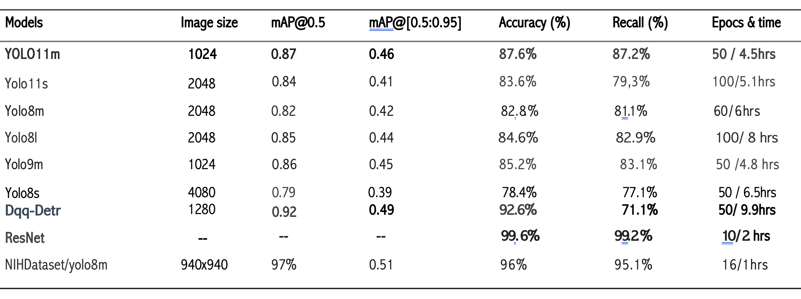

Figure 1: Model Performance Results

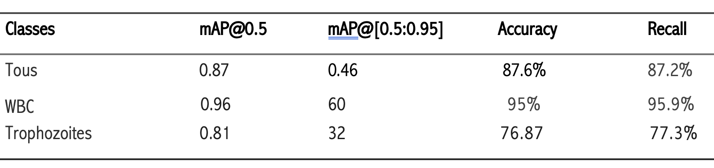

Figure 2: Table of Performance Results of the Selected YOLO Model Across Different Classes

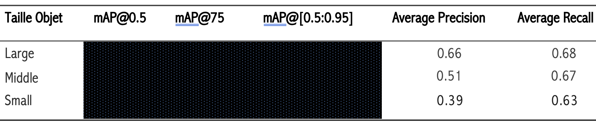

Figure 3: Table of Performance Results of the DETR Model Across Different Object Sizes

The Resnet model has 0.99 accuracy in classifying both positive and negative cells. The Detr model has a slightly higher mAP@50-95 (0.92) compared to Yolo’s (0.87), indicating better accuracy for easier IoU thresholds.

The DQ-Detr can produce fewer false positives,making it more accurate in localizing objects with more relaxed requirements. Generalized accuracy DDQ-Detr: 0.49 and YOLO: 0.46 for (mAP@50-95), Which indicates that DDQ-Detr has a slight advantage in terms of accu-
racy on IoU thresholds, potentially due to better localization handling.The recall rate represents the model’s intolerance towards false negatives. The DETR model has a higher recall (0.71) than YoLo11m (0.87), suggesting that DETR detects more objects but may include more false positives.

### Comparaison with state of art

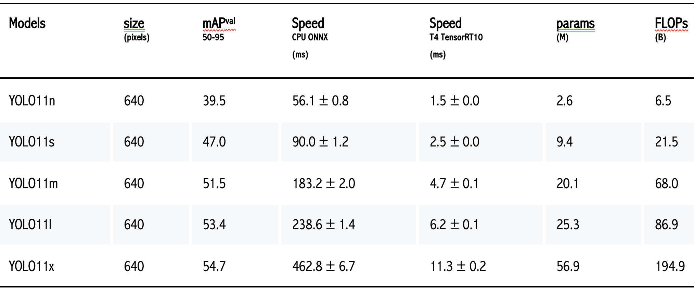

Figure 4: Table of Benchmark Performance of YOLOv11 Model Variants

The results of our study showed contrasting performances between YOLO and DETR models for parasite detection in medical images. While YOLO excels in its ability to detect many objects, especially smaller ones, DDQ-DETR, with its higher accuracy provides better localization and avoid some false positives. By combining the predictions of the three models (binary classification + YOLO + DETR), we obtained a final output that takes advantage of the strengths of each, thus optimizing parasite detection.

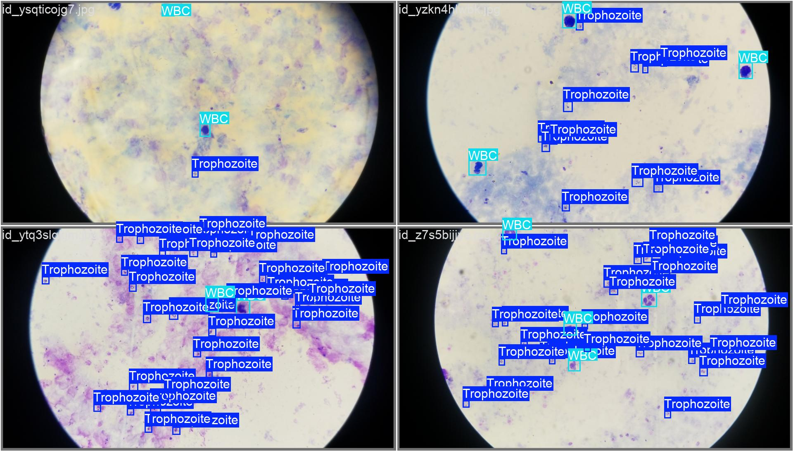

Figure 5: Examples of image detection results of Trophozoites and White Blood Cell (WBC)

### future work
In the future work, the use of ensemble learning could boost overall performance by combining predictions from multiple models via adapted weights, outperforming approaches such as non-maximum suppression (NMS). Introducing a preliminary model to filter out irrelevant images would also optimize resources and improve the analysis of critical cases. To add, applying test time augmentation methods, such as contrast variations or rotations, could increase the robustness of predictions to diverse data.

### Conclusion
We focused our efforts on improving the state of the art and, to some extent, contributed to the ongoing paradigm shift in the field of automated malaria diagnosis from microscopic images of blood smears. This project explored and demonstrated the effectiveness of artificial intelligence in detecting malaria parasites from medical images, addressing a critical need in endemic regions where trained parasitologists are often lacking. Despite these constraints, the integration of innovative technologies has yielded promising results. The model was then deployed in an end-to-end mobile system, specifically designed to address local constraints in these regions.